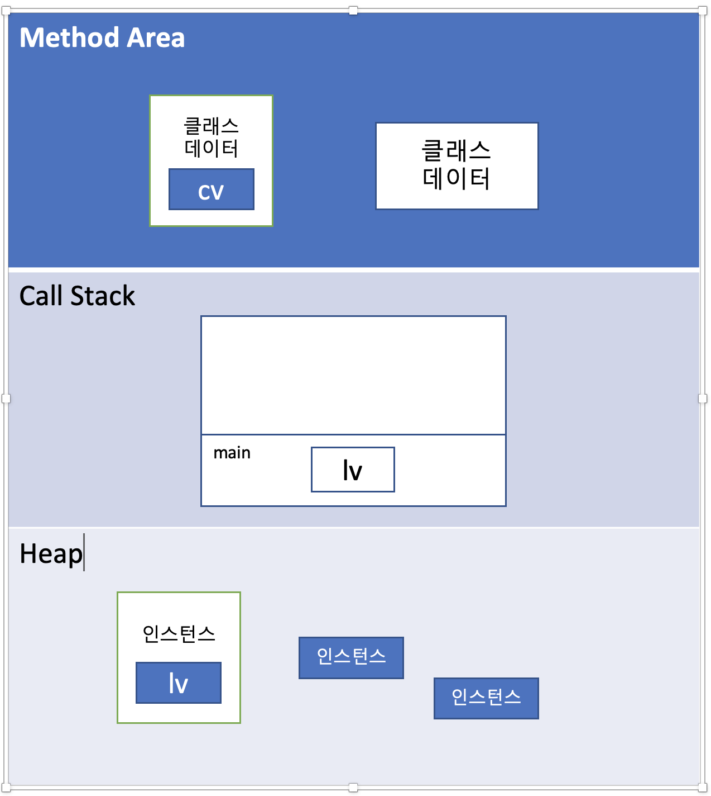

# Chapter 06 - 객체지향 프로그래밍 1
---

##### 객체지향언어란?
- 실제 세계는 객체로 이루어져 있으며, 발생하는 모든 사건들은 객체간의 상호작용
- 특징
    1. 코드의 재사용성이 높음
    2. 코드의 관리가 용이
    3. 신뢰성이 높은 프로그래밍 가능
    
> 처음부터 고민하기 보다 일단 기능적으로 완성한 다음 리팩토링 하기!

##### 클래스와 객체
- 클래스: 객체를 정의해 놓은 것으로 객체 생성하는데 사용 ex) 제품 설계도
- 객체: 실재로 존재하는 것으로 용도는 객체가 갖는 기능과 속성에 따라 다름 ex) 제품
- 클래스를 잘 만들어두면, 매번 객체를 생성할 때마다 어떻게 객체를 만들어야 할지 고민하지 않아도 됨

##### 객체와 인스턴스
- 인스턴스화(Instantiate): 클래스로부터 객체를 만드는 과정
- 인스턴스(Instance): 어떤 클래스로부터 만들어진 객체
- 객체는 모든 인스턴스를 대표하는 총괄적 의미 / 인스턴스는 보다 구체적인 의미

##### 객체의 구성요소 - 속성과 기능
- 속성(property) = 멤버 변수(member variable)
- 기능(function) = 메서드(method)
- ex)
  
  |구분|예시|
  |:---|:---|
  |속성|크기, 길이, 높이, 색상, 볼륨, 채널 등|
  |기능|켜기, 끄기, 볼륨 높이기, 채널 변경하기 등|

```java
class TV {
    String color; // 색깔
    boolean power; // 전원 상태
    int channel; // 채널
    
    void power() {
        power != power;
    }
    void channelUp() {
        channel++;
    }
    void channerDown() {
        channel--;
    }
}
```

##### 인스턴스의 생성과 사용
```java
Tv t; // Tv 클래스 타입의 참조변수 t 선언
t = new Tv(); // Tv인스턴스를 생성한 후, 생성된 Tv인스턴스의 주소를 t에 저장
```

> 인스턴스는 참조변수를 통해서만 다룰 수 있으며, 참조변수의 타입은 인스턴스 타입과 일치해야함

##### 객체 배열
- 객체 배열 안에 객체의 주소가 저장
- `Tv[] tvArr = new Tv[3];`: 길이가 3인 Tv타입의 참조변수 배열

##### 클래스의 또 다른 정의
1. 변수
  - 하나의 데이터를 저장할 수 있는 공간
2. 배열
  - 같은 종류의 여러 데이터를 하나의 집합으로 저장할 수 있는 공간
3. 구조체
  - 서로 관련된 여러 데이털르 종류에 관계없이 하나의 집합으로 저장할 수 있는 공간
4. 클래스
  - 데이터와 함수의 결합(구조체 + 함수)

##### 변수와 메서드
변수의 종류|선언 위치|생성 시기
---|---|---
클래스 변수|클래스 영역|클래스가 메모리에 올라갈 때
인스턴스 변수|클래스 영역|인스턴스가 생성되었을 때
지역 변수|클래스 영역 이외의 영역(메서드, 생성자, 초기화 블럭 내부)|변수 선언문이 수행되었을 때

1. 인스턴스 변수(Instance Variable)
  - 인스턴스는 독립적 저장공간을 갖게됨
2. 클래스 변수(Class Variable)
  - 인스턴스 변수 앞에 `static`을 붙임
  - 모든 인스턴스가 공통된 저장공간을 공유
  - `public`을 붙이면 전역변수의 성격을 갖게됨
3. 지역 변수(Local Variable)
  - 메서드 내에 선언되어 메서드 내에서만 사용 가능

- 클래스 변수 사용 시 '클래스이름.클래스변수'의 형태로 사용하는 것이 좋음

> 인스턴스 변수는 인스턴스가 생성될 때마다 생성되므로 인스턴스마다 각기 다른 값을 유지할 수 있지만, 
> 클래스 변수는 모든 인스턴스가 하나의 저장공간을 공유하므로, 항상 공통된 값을 갖는다.

##### 메서드
- 특정 작업을 수행하기 위한 일련의 문장들을 하나로 묶은 것
- 사용 이유
  1. 높은 재사용성(reusability)
  2. 중복된 코드의 제거
  3. 프로그램의 구조화
    - 처음에 메서드를 작업 단위로 만들고 하나씩 완성해가기
  
- 선언과 구현
  ```java
  /*
  * 반환타입 메서드이름 (타입 변수명, 타입 변수명, ... )
  * { // 메서드 호출시 수행될 코드 }
  */
  int add (int a, int b) {
    int result = a + b;
    return result;
  }
  ```
- 메서드 반환타입이 void가 아닌경우, 'return 반환값'이 반드시 포함되어 있어야하며, 반환타입은 일치하거나 적어도 자동 변환이 가능한 것이어야 함

- 메서드 호출
  - 메서드 호출 시 ()안에 지정해준 값들 = 인자(argument)
  - 인자는 메서드 호출되면서 매개변수에 대입
  
- 매개변수의 유효셩 검사
  - 가장 먼저 매개변수의 값이 적절한지 확인하기
  
##### JVM의 메모리 구조
- 

1. 메서드 영역(method area)
  - 프로그램 실행 중 어떤 클래스가 사용되면, JVM은 해당 클래스의 클래스파일(*.class)을 읽고 분석하여 클래스 데이터를 이곳에 저장
  - 클래스 변수도 이 영역에 함께 생성
2. 힙(heap)
  - 인스턴스 변수들이 생성되는 공간
3. 호출스택(call stack or execution stack)
  - 메서드 작업에 필요한 메모리 공간 제공
  - 메서드 호출시 호출스택에 호출된 메서드를 위한 메모리가 할당되고, 이 메모리는 지역변수들과 연산의 중간결과 등을 저장하는데 사용
  - 메서드가 작업을 마치면 할당되었던 메모리공간은 반환되어 비워짐

> - 메서드가 호출되면 수행에 필요한 만큼의 메모리를 스택에 할당받음
> - 메서드가 수행을 마치고나면 사용했던 메모리를 반환하고 스택에서 제거
> - 호출스택의 제일 위에 있는 메서드가 현재 실행 중인 메서드 
> - 아래에 있는 메서드가 바로 위의 메서드를 호출한 메서드

##### 기본형 매개변수와 참조형 매개변수
- 기본형 매개변수: 변수의 값을 읽기만 할 수 있음(read only)
- 참조형 매개변수: 변수의 값을 읽고 변경할 수 있음(read & write)

##### 참조형 반환타입
> 반환타입이 '참조형'이라는 것은 메서드가 '객체의 주소'를 반환한다는 것

##### 재귀호출(Recursive call)
- 메서드의 내부에서 메서드 자신을 다시 호출하는 것
- 무한루프에 빠지지 않기 위해서는 조건문이 반드시 있어야 함
- 논리적 간결함

##### 클래스 메서드(static 메서드)와 인스턴스 메서드
- 인스턴스 메서드는 인스턴스 변수와 관련된 작업을 하는, 즉 메서드의 작업을 수행하는데 인스턴스 변수를 필요로하는 메서드
- 인스턴스와 관계없는 메서드를 클래스 메서드로 정의

1. 클래스를 설계할 때, 멤버변수 중 모든 인스턴스에 공통으로 사용하는 것에 static을 붙임
2. 클래스 변수(static 변수)는 인스턴스를 생성하지 않아도 사용 가능
3. 클래스 메서드(static 메서드)는 인스턴스 변수를 사용할 수 없음
4. 메서드 내에서 인스턴스 변수를 사용하지 않으면, static을 붙이는 것을 고려

> 클래스의 멤버변수 중 모든 인스턴스에 공통된 값을 유지해야하는 것이 있는지 살펴보고 있으면, `static`을 붙여줌
> 작성한 메서드 중에서 인스턴스 변수나 인스턴스 메서드를 사용하지 않는 메서드에 `static`을 붙일 것을 고려

##### 클래스 멤버와 인스턴스 멤버간의 참조와 호출
- 인스턴스 멤버가 존재하는 시점에 클래스 멤버는 항상 존재하지만, 클래스 멤버가 존재하는 시점에 인스턴스 멤버가 존재하지 않을 수도 있 

##### 참고!
```java
MemberCall c = new MemberCall();
int result = c.instanceMethod1();
```
-> 한줄로 요약
```java
int result = new MemberCall().instanceMethod1();
```